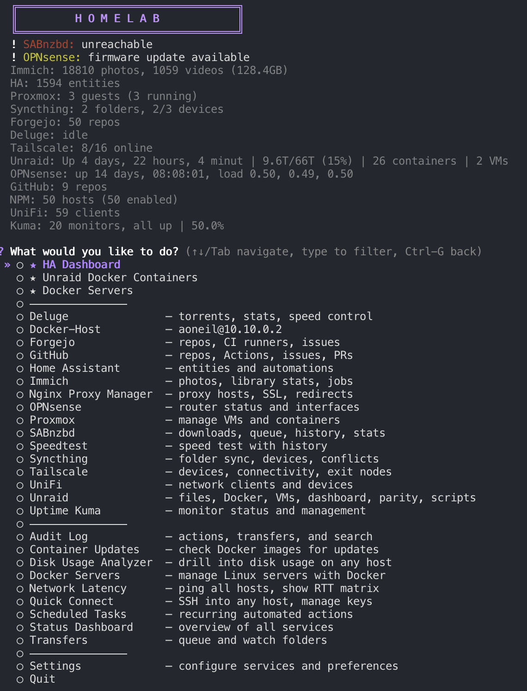

# Homelab

**Self-Hosted Infrastructure Manager** — a terminal UI for managing your homelab services.

Browse and transfer files over SSH, manage Docker containers across multiple servers, control VMs, monitor network clients, and interact with your smart home — all from one interactive CLI.



## Disclaimer

This project was vibe coded with [Claude Code](https://claude.ai/code). Although I have extensively tested this tool within my homelab, please review before blindly executing code.

## Features

### File Management
- **File Manager** — browse, rename, move, copy, delete, preview, edit files on your server
- **Transfer to Server** — download from web (wget, curl, git, yt-dlp) and send to server
- **Upload Local Files** — send files from your computer via rsync
- **Download from Server** — pull files to your local machine, with compress & download option
- **Search** — find files by name, content (grep), or file type within any folder
- **Find Duplicates** — scan for duplicate files by size + partial hash
- **Multi-select** — batch download, delete, move, or compress multiple items
- **Batch Rename** — regex-based renaming across files in a directory
- **Bookmarks** — save and jump to frequently used folders
- **Trash** — soft-delete with restore (sidecar `.origin` files track original paths)

### Service Plugins (23)
- **Localhost** — local file manager (browse, rename, move, copy, delete, preview, edit, search, duplicates, batch rename, trash), system info, resource monitor (live CPU/RAM/disk/network trends), process manager, network tools (interfaces, connections, DNS, port check), disk usage analyzer, local Docker management (containers, compose, stats, resource graphs, images, prune), service manager (systemd/launchctl)
- **Unraid** — dashboard (disk usage, CPU, RAM, SMART), Docker management (containers, compose, bulk operations, stats, resource graphs, image management, system prune, per-container update), VMs (virsh start/stop/restart/snapshot), parity check, notification center, user scripts, live logs (syslog + container + multi-container)
- **Docker Servers** — manage any Linux server with Docker over SSH. Per-server: containers (start/stop/restart/shell/logs/inspect/update), compose (up/down/pull & up/edit/validate/restart service), bulk operations, docker stats, resource graphs, image management, system prune, container update checks, file browser, system stats, live logs (including multi-container + search)
- **Proxmox** — QEMU VMs and LXC containers (start, stop, reboot, snapshot), resource usage with bar charts, console access (SSH/noVNC)
- **UniFi** — view active network clients, devices, and search by hostname or MAC
- **OPNsense** — system status, interface info, ARP table, DHCP leases
- **Home Assistant** — browse entities by domain, view states/attributes, toggle switches/lights, call services, configurable dashboard view
- **Uptime Kuma** — monitor overview with status/ping/uptime, filter to down monitors, **service health map** (ASCII topology of all services with live up/down status)
- **Nginx Proxy Manager** — list/add/edit proxy hosts, redirections, SSL certificates
- **Tailscale** — list devices, ping, manage exit nodes (via SSH to server)
- **Forgejo** — repositories, CI runners, issues (Gitea-compatible API)
- **GitHub** — repositories, Actions runners, issues, pull requests via GitHub REST API
- **Immich** — library stats, server info, job management, recent uploads, albums
- **Syncthing** — folder sync status, connected devices, conflicts, system status
- **Sonarr** — TV series, calendar, queue, wanted episodes, search & add
- **Radarr** — movies, calendar, queue, wanted films, search & add
- **Lidarr** — music artists, albums, wanted tracks, search & add
- **Plex** — library scan trigger
- **Jellyfin** — library scan trigger
- **SABnzbd** — send NZBs and URLs
- **Deluge** — send torrents and magnet links
- **Speedtest** — local speed test with history tracking and trend charts
- **Ansible** — playbook runner, inventory viewer via SSH

### Tools
- **Status Dashboard** — unified overview pulling widgets from all configured plugins
- **Quick Connect** — SSH into any configured host (Unraid, Proxmox, HA, Docker servers + custom hosts)
- **Container Updates** — compare running Docker image digests against the registry, shows what's outdated
- **Health Monitor** — alerts for unhealthy containers, low disk, high CPU shown in the main menu header
- **Watch Folders** — monitor local directories and auto-upload new files to the server
- **Transfer Queue** — background batched transfers with worker thread and notifications
- **Audit Log** — timestamped action history with search (stored in `~/.homelab_audit.json`)
- **SSH Key Manager** — generate keys, view fingerprints, deploy to servers via ssh-copy-id
- **Session Restore** — remembers your last menu selection, offers to resume on next launch
- **Download Client** — send URLs/magnets to SABnzbd or Deluge, upload .nzb/.torrent files
- **Media Scan** — trigger Plex or Jellyfin library scans
- **Open in VSCode** — launch VSCode Remote-SSH to your server workspace
- **History** — view and re-run past transfers
- **Favorites** — pin frequently used actions to the top of the menu

### Customization
- **Themes** — 10 preset color palettes (default, dracula, nord, catppuccin, gruvbox, tokyo night, solarized, rose pine, monokai, ocean) + custom hex color
- **Config Encryption** — sensitive values (API keys, passwords) encrypted with Fernet
- **Export/Import Config** — password-protected encrypted backup for migration between machines

## Installation

### With pipx (recommended)
```bash
pipx install git+https://github.com/a-oneil/homelab.git
```

### With pip
```bash
pip install git+https://github.com/a-oneil/homelab.git
```

### From source
```bash
git clone https://github.com/a-oneil/homelab.git
cd homelab
pip install -e .
```

### Updating
```bash
# pipx
pipx upgrade homelab

# pip
pip install --upgrade git+https://github.com/a-oneil/homelab.git

# From source
cd homelab
git pull
pip install -e .
```

### Dependencies
- Python 3.7+
- `questionary` — interactive terminal menus
- `cryptography` — Fernet encryption for config secrets
- `uptime-kuma-api` — Uptime Kuma integration
- `speedtest-cli` — local speed testing
- SSH client with key-based auth configured

## First Run

```bash
homelab
```

On first run, Homelab creates `~/.homelabrc` with default settings. Go to **Settings** to configure:

1. **SSH Host** — your server's SSH address (e.g. `root@10.0.0.5`)
2. **Remote Base** — the base path for file browsing (e.g. `/mnt/user`)
3. **Service credentials** — configure any services you want to use

### SSH Setup
Homelab uses SSH key-based authentication. Make sure you can connect without a password:
```bash
ssh-copy-id root@your-server-ip
```

Or use the built-in **SSH Key Manager** (Settings > SSH Keys) to generate and deploy keys.

## Plugin Configuration

### Localhost
No configuration needed — always available. Optionally install `psutil` for system tools (CPU, memory, disk, process manager, network tools):
```bash
pip install psutil
```
Docker management appears automatically if Docker is installed locally. Service manager supports systemd (Linux) and launchctl (macOS).

### Unraid
Set SSH Host and Remote Base in Settings. Optionally configure:
- Unraid API URL + Key for GraphQL access
- VSCode workspace path and SSH host alias
- Trash path for soft-delete

### Docker Servers
Add any number of Linux servers via Docker Servers menu:
- **Name** — display name for the server
- **SSH Host** — SSH connection string (e.g. `root@10.0.0.5`)
- **Base Path** — root path for file browser (default: `/`)
- **SSH Port** — optional non-standard port

Each server gets its own full Docker management suite: containers, compose, images, stats, resource graphs, bulk operations, system prune, and more.

### Proxmox
- **URL**: `https://your-proxmox-ip:8006`
- **API Token**: Create in Proxmox > Datacenter > API Tokens (format: `user@realm!tokenname=uuid`)
- **Node**: Your Proxmox node name (e.g. `pve`)

### UniFi
- **URL**: `https://your-controller-ip:8443`
- **Username/Password**: Your UniFi controller credentials
- **Site**: Usually `default`

### OPNsense
- **URL**: `https://your-opnsense-ip`
- **API Key/Secret**: Create in OPNsense > System > Access > Users > API Keys

### Home Assistant
- **URL**: `http://your-ha-ip:8123`
- **Token**: Create a Long-Lived Access Token in HA > Profile > Security

### Uptime Kuma
- **URL**: `http://your-kuma-ip:3001`
- **Username/Password**: Your Uptime Kuma login credentials

### Nginx Proxy Manager
- **URL**: `http://your-npm-ip:81`
- **Email/Password**: Your NPM admin credentials

### Tailscale
- Enable in Settings — runs `tailscale` CLI via SSH on your server

### Forgejo
- **URL**: `https://your-forgejo-instance`
- **Token**: Create in Forgejo > Settings > Applications > Access Tokens

### GitHub
- **Token**: Create a Personal Access Token at GitHub > Settings > Developer Settings > Tokens

### Immich
- **URL**: `http://your-immich-ip:2283`
- **API Key**: Create in Immich > Account Settings > API Keys

### Syncthing
- **URL**: `http://your-syncthing-ip:8384`
- **API Key**: Found in Syncthing > Settings > GUI > API Key

### Sonarr / Radarr / Lidarr
- **URL**: `http://your-instance-ip:port`
- **API Key**: Found in Settings > General > API Key

### Media Servers
- **Plex**: URL + X-Plex-Token
- **Jellyfin**: URL + API Key

### Download Clients
- **SABnzbd**: URL + API Key
- **Deluge**: URL + Web UI Password

### Ansible
- **SSH Host**: Server with Ansible installed
- **Playbook Path**: Directory containing your playbooks
- **Inventory Path**: Path to your Ansible inventory file

## CLI Flags

```
homelab                      Interactive mode
homelab --history            View transfer history
homelab --dashboard          Server dashboard
homelab --dry-run            Toggle dry run mode
homelab --install-completions Install shell completions (zsh + bash)
homelab --help               Show this help
```

## Cross-Platform

Homelab works on macOS and Linux:
- Desktop notifications: `osascript` (macOS), `notify-send` (Linux)
- Clipboard: `pbcopy` (macOS), `xclip` (Linux), `clip` (Windows)
- Hostname: `scutil --get ComputerName` (macOS), `platform.node()` (Linux)
- All local paths use `os.path.expanduser("~")` — no hardcoded paths

## Architecture

```
homelab/
├── main.py               # Entry point, CLI args, main menu loop, plugin registry
├── config.py             # Config loading/saving, defaults, migration
├── keychain.py           # Fernet encryption for sensitive config values
├── ui.py                 # Colors, pick_option, pick_multi, bar_chart, sparkline, scrollable_list
├── history.py            # Transfer history
├── notifications.py      # Desktop + Discord webhook notifications
├── themes.py             # Theme system (10 presets + custom)
├── modules/
│   ├── transport.py      # ssh_run, rsync_transfer, disk space check
│   ├── files.py          # File manager, browse, upload, download, search, trash, bookmarks
│   ├── dashboard.py      # Status Dashboard
│   ├── healthmonitor.py  # Health Monitor alerts
│   ├── healthmap.py      # Service Health Map (ASCII topology)
│   ├── watchfolder.py    # Watch Folders (auto-upload)
│   ├── transferqueue.py  # Transfer Queue (background batched transfers)
│   ├── quickconnect.py   # Quick Connect (unified SSH menu)
│   ├── containerupdates.py # Container Updates (image digest comparison)
│   ├── auditlog.py       # Audit Log
│   ├── sshkeys.py        # SSH key generation, viewing, deployment
│   ├── scheduler.py      # Scheduled Tasks (cron-like recurring actions)
│   ├── diskusage.py      # Disk usage analysis
│   ├── firewall.py       # Firewall rule viewer
│   ├── latency.py        # Network latency testing
│   ├── mounts.py         # Mount point management
│   ├── portmap.py        # Port mapping viewer
│   ├── processes.py      # Process management
│   ├── services.py       # Systemd service management
│   └── volumes.py        # Volume management
└── plugins/
    ├── __init__.py       # Plugin base class
    ├── localhost.py      # Localhost (local files, system tools, Docker, services)
    ├── unraid.py         # Unraid (dashboard, Docker, VMs, parity, scripts, logs)
    ├── dockerhost.py     # Docker Servers (multi-server Docker management)
    ├── proxmox.py        # Proxmox (VMs, LXC, resources)
    ├── unifi.py          # UniFi (network clients)
    ├── opnsense.py       # OPNsense (router status)
    ├── homeassistant.py  # Home Assistant (entities, services)
    ├── uptimekuma.py     # Uptime Kuma (monitors, health map)
    ├── npm.py            # Nginx Proxy Manager
    ├── tailscale.py      # Tailscale (devices, exit nodes)
    ├── forgejo.py        # Forgejo (repos, CI, issues)
    ├── github.py         # GitHub (repos, Actions, issues, PRs)
    ├── immich.py         # Immich (photos, albums)
    ├── syncthing.py      # Syncthing (folders, devices)
    ├── arr.py            # Shared Arr base class
    ├── sonarr.py         # Sonarr (TV)
    ├── radarr.py         # Radarr (Movies)
    ├── lidarr.py         # Lidarr (Music)
    ├── plex.py           # Plex
    ├── jellyfin.py       # Jellyfin
    ├── sabnzbd.py        # SABnzbd
    ├── deluge.py         # Deluge
    ├── speedtest.py      # Speedtest
    └── ansible.py        # Ansible
```

## Adding a Plugin

1. Create `homelab/plugins/myservice.py`
2. Define a class extending `Plugin` with required methods:
   - `is_configured()` — checks if required config fields are set
   - `get_config_fields()` — returns settings for auto-generated settings menu
   - `get_menu_items()` — returns items for the main menu
   - `get_actions()` — returns actions for the favorites system
   - Optional: `get_header_stats()`, `get_health_alerts()`, `get_dashboard_widgets()`, `resolve_favorite()`
3. Import and add to `PLUGINS` in `homelab/main.py`
4. Add default config keys to `DEFAULT_CONFIG` in `homelab/config.py`

The plugin's config fields auto-appear in Settings, and menu items auto-appear when configured.

## Config Files

| File | Purpose |
|------|---------|
| `~/.homelabrc` | Main config (JSON) — all settings, plugin credentials |
| `~/.homelab.key` | Fernet encryption key for sensitive config values |
| `~/.homelab_history.json` | Transfer history (last 100 entries) |
| `~/.homelab_audit.json` | Audit log (last 500 entries) |

## License

This project is licensed under the MIT License — see [LICENSE](LICENSE) for details.
